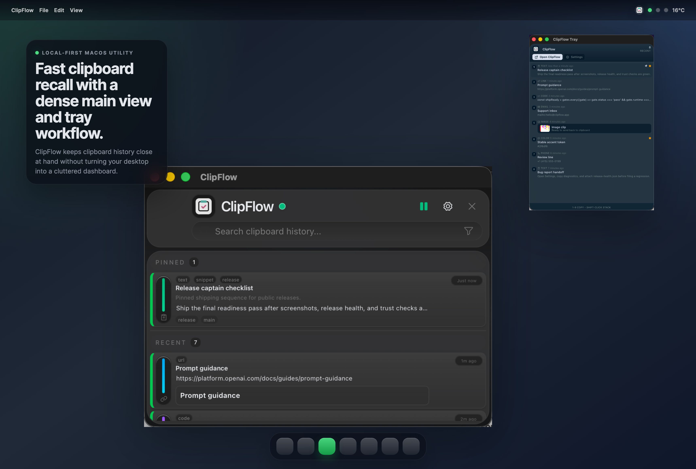
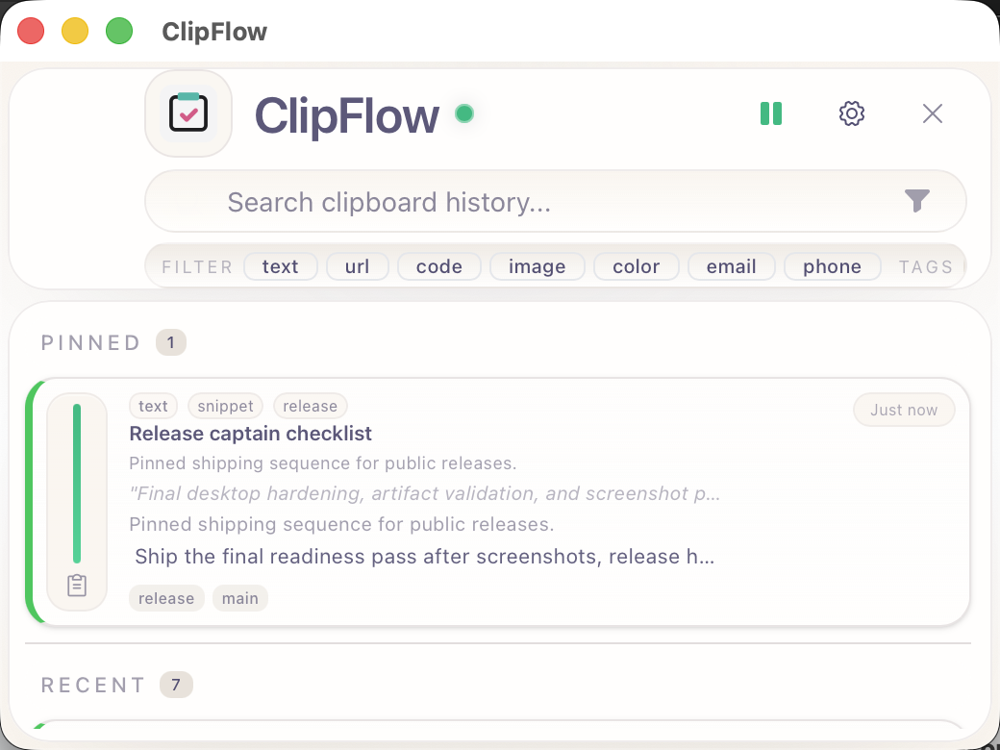
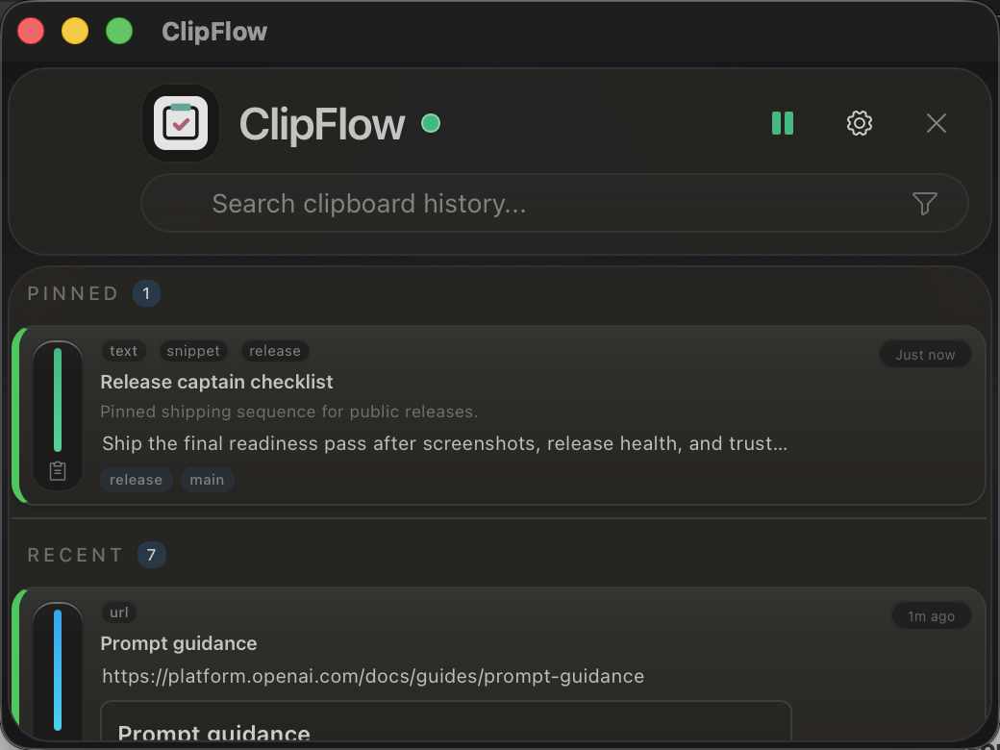
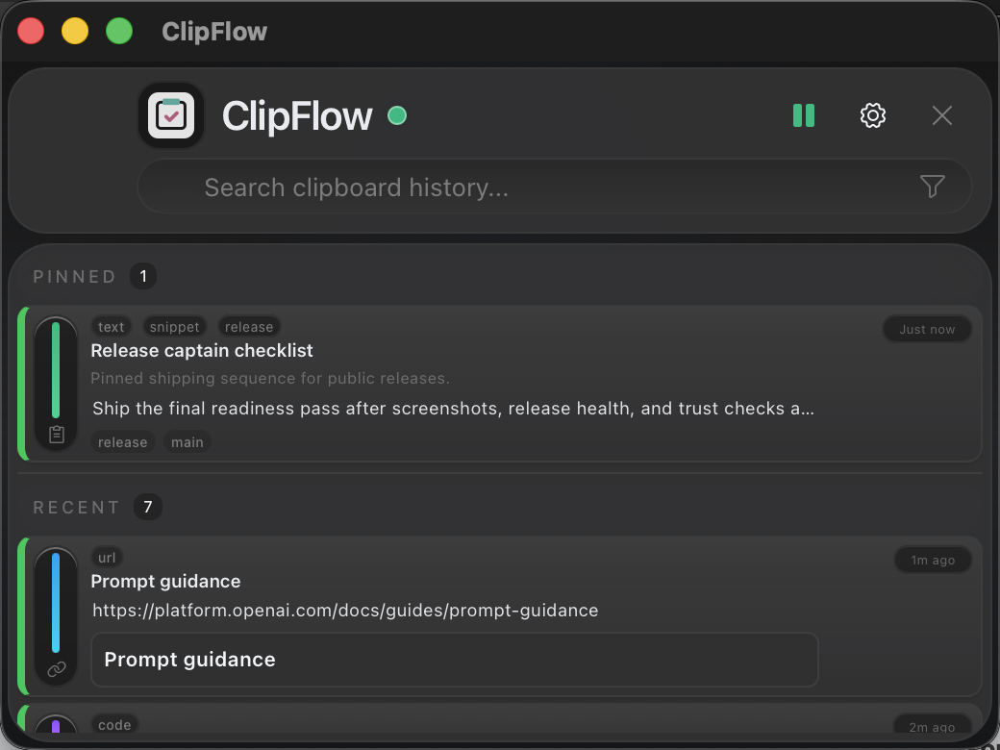
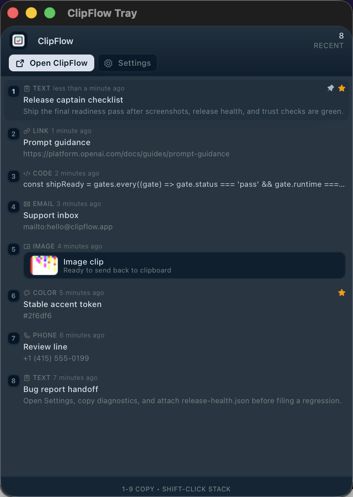
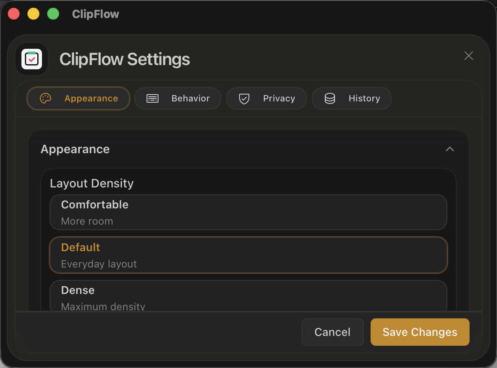

# ClipFlow

  

  
  <h2>Fast Clipboard Recall For macOS</h2>
  

    ClipFlow is a dense, local-first clipboard manager built for fast search,
    tray-first utility, and a serious desktop workflow that stays compact by default.
  

## Start Here

If you only do three things, make them these:

1. Download the `.dmg` from [Releases](https://github.com/WestonGFX/clipflow-app/releases).
2. Read [docs/install-and-upgrade.md](docs/install-and-upgrade.md) if macOS asks for trust confirmation or you are upgrading from an older build.
3. Use the issue templates below for bugs, install problems, feature requests, or UX feedback.

## Why ClipFlow

ClipFlow is built around a few simple ideas:

- local-first history instead of cloud dependency
- fast recall instead of ornamental UI
- one main window for depth and one tray surface for speed
- practical privacy, diagnostics, and recovery controls

It is designed to feel like a real Mac utility you can trust all day, not a novelty layer on top of your clipboard.

## Downloads

The latest public builds live in:

- [Releases](https://github.com/WestonGFX/clipflow-app/releases)

For most people, the right download is:

- the `.dmg`

Use the zipped `.app` only as a fallback if the DMG route gives you trouble.
The checksum, manifest, and validation files are for support and verification, not the normal install path.

Install notes, trust caveats, upgrade guidance, and migration steps live in:

- [docs/install-and-upgrade.md](docs/install-and-upgrade.md)
- [docs/release-assets.md](docs/release-assets.md)

If the current build is not yet Developer ID signed and notarized, the install guide includes the local-open workaround and explains what that means.

## Product Gallery

### Density Range

<table>
  <tr>
    <td align="center" width="33.3%">
      <strong>Comfortable · Dawnfox</strong> 
      
    </td>
    <td align="center" width="33.3%">
      <strong>Compact · Kanagawa Dragon</strong> 
      
    </td>
    <td align="center" width="33.3%">
      <strong>Dense · Carbonfox</strong> 
      
    </td>
  </tr>
</table>

### More Surfaces

<table>
  <tr>
    <td align="center" width="50%">
      <strong>Tray · Night Owl</strong> 
      
    </td>
    <td align="center" width="50%">
      <strong>Settings · Kanagawa Dragon</strong> 
      
    </td>
  </tr>
</table>

## What ClipFlow Does Today

- fast local search over clipboard history
- tray workflow and quick recall
- dense main window with multiple density modes
- pins, favorites, snippets, tags, and filtering
- diagnostics, recovery, export, and reset tooling
- local-only storage in the app support directory

## Roadmap

The public roadmap stays intentionally short. Detailed feature planning stays in the private development repo, but these are the current highest-priority future directions:

1. Stronger importers so switching from other clipboard tools feels less painful.
2. More useful transforms that clean up copied text without silently rewriting history.
3. Better local smart actions for links, dates, code, and reusable snippets.
4. Auto-update once signing and notarization are fully stable.
5. A future Windows version after the Mac app is stronger and the parity path is clear.
6. Smarter local-only retrieval features only if they can stay fast, private, and trustworthy.

If you want to influence the order, use feature requests and the roadmap feedback thread in this repo rather than treating the README as a live poll.

- [Roadmap feedback thread](issues/1)

## Feedback And Support

Use GitHub Issues in this repo for:

- bugs
- install or trust problems
- feature requests
- screenshot and UX feedback

Start here:

- [Report a bug](issues/new?template=bug_report.yml)
- [Report an install or trust problem](issues/new?template=install_trust_issue.yml)
- [Request a feature](issues/new?template=feature_request.yml)
- [Share screenshot or UX feedback](issues/new?template=screenshot_ux_feedback.yml)
- [Roadmap feedback thread](issues/1)

## Source And Development

This public repo is the release and feedback surface. The private source repo remains separate.

If you are reviewing ClipFlow as a product, use this repo.
If you have direct access to the private engineering repo, use that one for code, release engineering, and implementation details.
